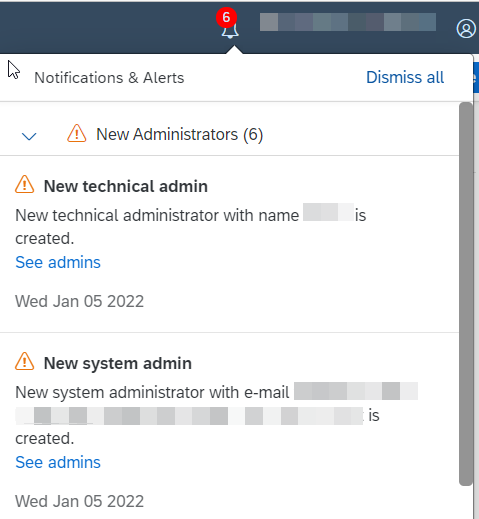

<!-- loio8f61880dc1c145e3ad7097e461479186 -->

# Application Types

<a name="loio8f61880dc1c145e3ad7097e461479186__section_nh2_zhh_w5b"/>

## Bundled, Charged Applications

Bundled applications are recognized by Identity Authentication as SAP applications, while charged applications are third party application.

Identity Authentication identifies the type of the application by the URI or SAML 2.0 endpoints. If no URI or SAML 2.0 endpoints are specified in the configuration of the application, Identity Authentication recognizes the application as a charged one.

> ### Note:  
> Applications using custom domains cannot be marked correctly, so if you have such applications, report an incident on [SAP Support Portal Home](https://support.sap.com/en/index.html) with a component `BC-IAM-IDS`.

> ### Remember:  
> Bundled applications that are managed and configured by SAP cannot be deleted. Part of their SAML 2.0 configurations are read-only. For more information, see [Configure an Application's Type](Operation-Guide/configure-an-application-s-type-6fee9c3.md).

### Parent, Child Applications

Bundled and charged applications can also be parent or child. An application can be defined as parent or child at its creation, or later when editing the application.

When you create or edit an application, you can select a parent for that application. Thus the application that is created or edited becomes child, and the selected application becomes parent. When creating a new application, the parent application option in the administration console is optional.

Changing child application's configuration doesn't affect the configuration of the parent.

Applications that have a parent application configured can't be selected as parent application.

An application that is chosen as a parent application to another can't have a parent application assigned for it.

Newly created OpenID Connect applications with an assigned parent application will inherit all the configurations from the parent with the except of the `Client ID` and `Consumed Services`.

Newly created SAML 2.0 applications with an assigned parent application will inherit all the configurations from the parent.

The inherited configurations will be marked as such.

Existing applications that have a parent application assigned to them will inherit only the configurations that have not been changed including the configurations that are made at the creation of the application. The configurations that are changed, and the configurations made at the creation of the application are not inherited. See the list below for the configurations made at the creation of the application:

-   Protocol
-   Subject Name Identifier
-   Default Name ID Format
-   Assertion Attributes
-   Client Authentication
-   Consumed Services
-   Risk-Based Authentication
-   E-Mail Verification
-   Password Policy
-   Terms Of Use
-   Privacy Policy
-   User Application Access
-   User Attributes for Access
-   Token Url Separator
-   Reload Parent Page

<a name="loio8f61880dc1c145e3ad7097e461479186__section_mxs_f4h_w5b"/>

## System Applications

Apart from the bundled and charged applications that you can create, the tenant of Identity Authentication has two additional system applications. They are predefined with the creation of the tenant. These applications are: `Administration Console`, and `User Profile`, previously called `SAP Cloud Identity`.

> ### Note:  
> In some tenants, the `User Profile` application still bears its previous name, `SAP Cloud Identity`.

> ### Tip:  
> If `Administration Console` or `User Profile` are not in the list of the system applications you may request them. To do this, report an incident on [SAP Support Portal Home](https://support.sap.com/en/index.html) under the component `BC-IAM-IDS`.

> ### Caution:  
> Please be careful when you make configuration changes to the system applications. Certain configuration options for the system applications are read-only.
> 
> System applications can't be parents to other applications, and can't have child applications.

The `Administration Console` application contains the configurations of the administration console for SAP Cloud Identity Services, and information about expiring certificates, system notifications and new administrators. The information is visible at the top right corner of the administration console:

 

You can access the tenant's administration console for SAP Cloud Identity Services by using the console's URL.

> ### Note:  
> The URL has the following pattern:
> 
> `https://<tenant ID>.accounts.ondemand.com/admin`
> 
> *Tenant ID* is an automatically generated ID by the system. The first administrator created for the tenant receives an activation e-mail with a URL in it. This URL contains the *tenant ID*. For more information about your tenants, see [Viewing Assigned Tenants and Administrators](viewing-assigned-tenants-and-administrators-f56e6f2.md).
> 
> If you have a configured custom domain, the URL has the `<your custom domain>/admin` pattern.

As a tenant administrator you can change the default configurations:

-   to configure stronger protection for the administration console for SAP Cloud Identity Services via the *Risk-Based Authentication* option.
-   to configure stronger password requirements for the tenant administrators of the administration console for SAP Cloud Identity Services.
-   to choose authenticating identity provider and define rules for authenticating identity provider.
-   to customize the look and feel of the sign-in page of the administration console for SAP Cloud Identity Services.

The `User Profile` application contains the configurations of the Profile Page.

As a tenant administrator you can change the default configurations:

-   to configure stronger protection via the *Risk-Based Authentication* option.
-   to choose authenticating identity provider and define rules for authenticating identity provider.
-   to define custom e-mail template sets for users created via the *Add User* option in the administration console for SAP Cloud Identity Services, or via the SCIM REST API.
-   to customize the look and feel of the sign-in page of the Profile Page.

> ### Note:  
> The URL of the profile page has the following pattern:
> 
> `https://<tenant ID>.accounts.ondemand.com`
> 
> *Tenant ID* is an automatically generated ID by the system.
> 
> If you have a configured custom domain, the URL is `<your custom domain`.

**Related Information**  

[User Types](user-types-70e95d1.md "")

[Cookies](cookies-e60fd04.md "")

