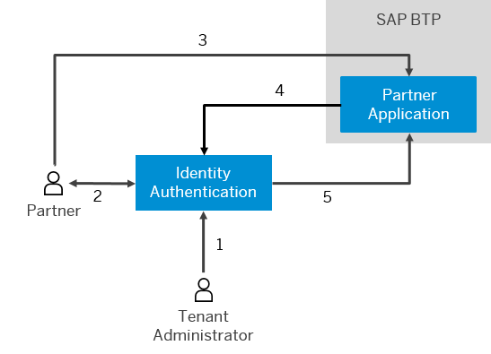

<!-- loio3908c37546cf4e3982145c4181df88be -->

# Business-to-Business Scenario

The business-to-business scenario is related to services for business partners. Unlike the business-to-consumer scenario, consumer self-registration is not allowed, and the administrator of the company is usually the one that triggers the user registration process.

The administrator invites partners or registers them on their behalf.

This scenario includes the following features:

-   Authentication with user name and password
-   A secure SSO to cloud applications
-   Social sign-on to cloud applications

    > ### Note:  
    > The content in this section is not relevant for China \(Shanghai\) region.

-   Invitation of partners by administrators
-   On-behalf registration of partners by administrators
-   Branding elements on all the forms for logon, password update, and account activation
-   Customized privacy policy and terms of use documents
-   Partner security policy
-   User import and export

> ### Example:  
> Donna Moore is a tenant administrator at company A. This company is a goods and services retailer. She would like to invite five transportation companies to join her organization in helping the distribution of goods and services to distant locations. The distributors will purchase from the *Company A Distribution* application. For this purpose, Donna registers these distributors on their behalf, logs on to the administration console for Identity Authentication, navigates to *Applications* \> *Company A Distribution* page, and chooses *Authentication and Access* \> *User Application Access*. She selects the *Private* radio button in order to restrict access to just these users. The partners then activate their registration via the on-behalf registration e-mail and can log on to the *Company A Distribution* application.
> 
> 
> 
> 1.  Invites or registers partner.
> 2.  Activates account.
> 3.  Provides credentials.
> 4.  Delegates authentication.
> 5.  Confirms authentication.

**Related Information**  

[Operation Guide](Operation-Guide/operation-guide-6a8e67c.md "This guide is for administrators. It explains how administrators can configure Identity Authentication so that users can have all enhanced features for each scenario.")

[Development](Development/development-55ab9b8.md "The developer guide is aimed mainly at organization developers who can implement configurations in addition to the ones in the administration console of Identity Authentication.")

[Configure User Access to the Application](Operation-Guide/configure-user-access-to-the-application-8b147c4.md "You can configure public access to the application allowing self-registration, or you can restrict the access to existing users or users registered by an application.")

